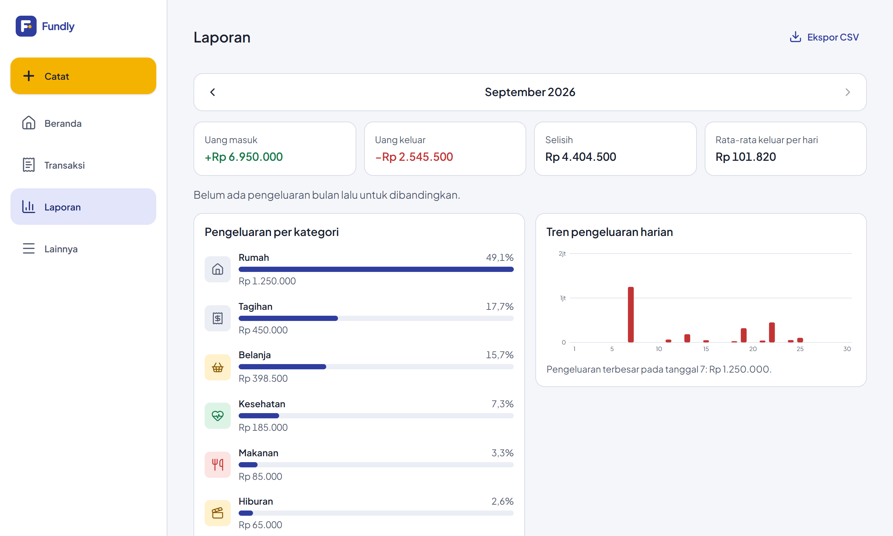

# Studi kasus: Fundly

Pencatat keuangan pribadi yang ringan, dibangun sebagai produk sekaligus portofolio full-stack. Dokumen ini merangkum masalah yang dipecahkan, keputusan teknis penting beserta alasannya, dan hal yang dipelajari selama pengerjaan.

  

## Masalah

Banyak orang tidak tahu ke mana uangnya pergi setiap bulan. Aplikasi pencatat yang ada sering terlalu rumit, berat di HP lama, atau tidak cocok dengan kebiasaan di Indonesia: dompet tunai, transfer bank, dan beberapa e-wallet sekaligus. Fundly punya tiga sasaran:

1. **Mencatat dalam kurang dari 10 detik dan maksimal 3 ketukan.**
2. **Tetap nyaman di HP spek rendah dan jaringan lambat**: JS awal ≤ 150 KB, Lighthouse mobile ≥ 90.
3. **Biaya infrastruktur Rp 0**, tanpa kartu kredit tersimpan di platform mana pun.

## Keputusan penting

### 1. Satu proyek Vercel, satu domain, backend Go sebagai satu server

Frontend statis dan backend Go disajikan dari domain yang sama lewat **Vercel Services**. Karena satu origin, cookie sesi bisa `HttpOnly` + `SameSite=Lax` tanpa CORS lintas domain. Backend tetap satu aplikasi chi biasa yang membaca `PORT`, bukan dipecah menjadi banyak fungsi kecil. Dengan begitu kodenya portabel: kalau Go runtime Vercel (masih Beta) bermasalah, aplikasi yang sama bisa dipindah ke Cloud Run atau Render tanpa ditulis ulang.

*Temuan saat implementasi:* sketsa awal di PRD (`functions` + `@vercel/go`) sudah tidak sesuai dokumentasi terbaru. Setelah verifikasi, konfigurasinya diganti menjadi `services`, dan catatannya ditambahkan ke PRD.

### 2. Postgres di Supabase dipakai "hanya sebagai database", dengan dua lapis pengaman

Supabase otomatis membuka tabel di skema `public` lewat Data API dengan kunci publik. Fundly tidak memakai Data API sama sekali, jadi:
- **RLS aktif di setiap tabel tanpa policy.** Ada tes yang gagal bila ada tabel `public` tanpa RLS, termasuk tabel versi milik goose.
- **Semua hak role `anon` dan `authenticated` dicabut**, termasuk *default privileges* untuk tabel yang dibuat nanti. Role ini tidak ada di Postgres lokal, jadi CI membuat role tiruan dengan grant bawaan seperti Supabase supaya migrasi pencabutan benar-benar teruji.
- Workflow mingguan mencoba membaca setiap tabel lewat Data API dengan kunci publik dan gagal bila ada data yang keluar.

### 3. Kontrak dulu, kode belakangan

`api-spec/openapi.yaml` (OpenAPI 3.1) adalah sumber kebenaran. Tipe Go dibuat oleh oapi-codegen (termasuk `nullable.Nullable[T]` untuk membedakan "tidak dikirim" dari "null" di PATCH), dan tipe TypeScript oleh openapi-typescript. CI men-generate ulang keduanya dan gagal bila hasilnya berbeda dari yang di-commit. Semua SQL ditulis di file `.sql` dan diubah menjadi kode Go oleh sqlc; setiap query data pengguna menyertakan `user_id` dari sesi.

### 4. Serverless + Postgres: koneksi yang tidak menghabiskan pool

Fungsi serverless bisa berjalan di banyak instance sekaligus. Backend memakai **transaction pooler** Supabase dengan pool pgx kecil (maksimal 3 koneksi) dan **tanpa prepared statement cache** (simple protocol), karena pooler mode transaksi tidak mendukung prepared statement. Pool dibuat sekali per instance dan dipakai ulang selama instance masih "hangat". Migrasi berjalan terpisah dari GitHub Actions lewat **session pooler**, dengan advisory lock goose agar dua migrasi tidak pernah berjalan bersamaan.

### 5. Cold start dan offline diperlakukan sebagai fitur

Fungsi yang jarang dipanggil butuh beberapa detik untuk bangun. Supaya pengguna tidak melihat layar kosong:
- **Service worker** melakukan precache cangkang aplikasi sehingga kunjungan ulang tampil instan.
- **Cache TanStack Query disimpan di IndexedDB**, sehingga data terakhir tetap terbaca saat offline. Status "belum masuk" sengaja tidak disimpan. Bug ini tertangkap tes E2E: status lama sempat dipulihkan setelah login dan melempar pengguna ke halaman masuk.
- **Klien API** memakai timeout 20 detik, retry dengan backoff, dan indikator "Menyambungkan…" setelah sekitar 2 detik.
- **Antrean transaksi offline** disimpan di IndexedDB. Setiap transaksi membawa `client_id` (UUID) yang dibuat saat form dibuka, dan backend memakai `ON CONFLICT (user_id, client_id) DO NOTHING`. Transaksi yang dikirim ulang karena retry, dua tab, atau jaringan putus di tengah jalan tidak pernah tercatat ganda.

Semua perilaku ini diuji Playwright: mode pesawat (reload saat offline → catat → online → tersinkron tepat sekali), server yang menolak POST, respons API yang sengaja diperlambat, dan backend yang benar-benar mati.

### 6. Auth yang bisa dijelaskan baris demi baris

- **Password** di-hash dengan argon2id (m=19 MiB, t=2, p=1). Login ke email yang tidak terdaftar tetap menjalankan hash palsu agar waktu respons tidak membocorkan email mana yang ada.
- **Token sesi** berupa 256 bit acak di cookie, sementara database hanya menyimpan hash SHA-256-nya. Sesi berlaku 30 hari dan diperpanjang paling sering sekali sehari agar tidak menulis ke database di setiap permintaan.
- **CSRF:** setiap POST/PUT/PATCH/DELETE wajib membawa header `X-Requested-With: fundly`.
- **Google OAuth** memakai PKCE dengan state bertanda tangan HMAC di cookie sekali pakai. Saat akun email lama ditautkan ke Google, password lama dihapus. Alasannya, email tidak diverifikasi saat daftar, jadi siapa pun bisa lebih dulu mendaftar dengan email korban. Kepemilikan email baru terbukti lewat Google.
- **Rate limit** memakai IP dari header yang ditulis edge Vercel, bukan `X-Forwarded-For` yang bisa dipalsukan klien. Linter (staticcheck) yang menandai celah di middleware `RealIP` bawaan chi.

### 7. Kategori otomatis tanpa AI

Aturan kata kunci sederhana (kata utuh atau awalan kata, tidak peka huruf besar dan tanda baca) sudah cukup untuk merchant sehari-hari seperti Indomaret, GoFood, atau PLN. Aturan pribadi selalu mengalahkan aturan bawaan. Setiap kali pengguna mengoreksi kategori, sistem menyimpan aturan `merchant → kategori` untuk dipakai berikutnya. Biaya dan latensinya nol, dan hasilnya bisa dijelaskan kepada pengguna.

### 8. Performa: ukur dulu, lalu ganti yang berat

Laporan awalnya memakai Recharts, yang di-lazy-load, tapi Lighthouse mencatat Total Blocking Time 710 ms di CPU yang di-throttle 4x. Grafik tren diganti menjadi SVG buatan sendiri (sekitar 2 KB) dan skornya naik dari 80 ke 97. Angka yang sempat terlihat buruk di beranda ternyata artefak pengukuran: preview Vite tidak mengompres file. Setelah diukur dengan server gzip yang meniru Vercel, semua halaman mendapat 96–97. Server itu kini dipakai Lighthouse CI di setiap pull request.

## Kualitas yang dijaga otomatis

- **Tes Go** (unit dan integrasi dengan Postgres sungguhan): auth, sesi, OAuth dengan penyedia palsu, isolasi antarpengguna untuk semua sumber daya, laporan, anggaran, ekspor, RLS, dan hak role Data API.
- **Vitest:** format uang, logika keypad, tanggal zona Asia/Jakarta, klien API (retry dan indikator lambat), serta antrean offline dengan fake-indexeddb.
- **Playwright:** alur lengkap PRD (daftar → dompet → catat → laporan → anggaran → ekspor CSV), offline dan cold start, serta 9 halaman di 5 viewport (360–1920 px) tanpa scroll horizontal, termasuk teks 200%.
- **Lighthouse CI:** performa ≥ 90 dan aksesibilitas ≥ 95 (mobile, throttled).
- **Linter:** golangci-lint (gosec, errorlint, revive, dan lainnya), ESLint, dan `tsc` strict.

Salah satu hasil nyata tes viewport: grid tanpa definisi kolom membuat track `auto` melebar sepanjang nama toko terpanjang, sehingga halaman bisa di-scroll horizontal di HP. Masalah itu ditemukan dan diperbaiki sebelum sampai ke pengguna.

## Yang saya pelajari

- **Verifikasi dokumentasi platform yang berstatus Beta sebelum menulis konfigurasi.** Dua kali asumsi dari dokumen perencanaan tidak sesuai kenyataan: bentuk konfigurasi Vercel untuk Go, dan pola `source` header yang tidak boleh memakai grup bersarang.
- **Offline-first menyentuh hal yang tidak terduga**, seperti cache siapa yang dipulihkan setelah login atau antrean milik pengguna mana yang boleh dikirim.
- **Keamanan paling murah dijaga dengan tes, bukan niat baik.** RLS, pencabutan hak, dan isolasi antarpengguna masing-masing punya tes yang akan gagal bila ada yang lupa.

## Batasan dan langkah berikutnya

- **Paket Vercel Hobby hanya untuk pemakaian non-komersial.** Monetisasi (Fase 3) mensyaratkan paket Pro.
- **Fase 2** mencakup foto struk dengan OCR di browser atau API opsional (bukan di fungsi serverless), transfer antardompet, dan patungan.
- **Sebelum rilis komersial**, nama dan merek "Fundly" perlu dicek ketersediaannya, begitu pula kewajiban UU Pelindungan Data Pribadi.
